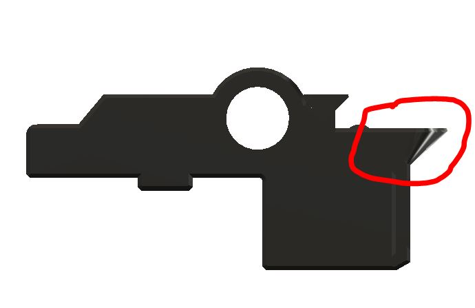
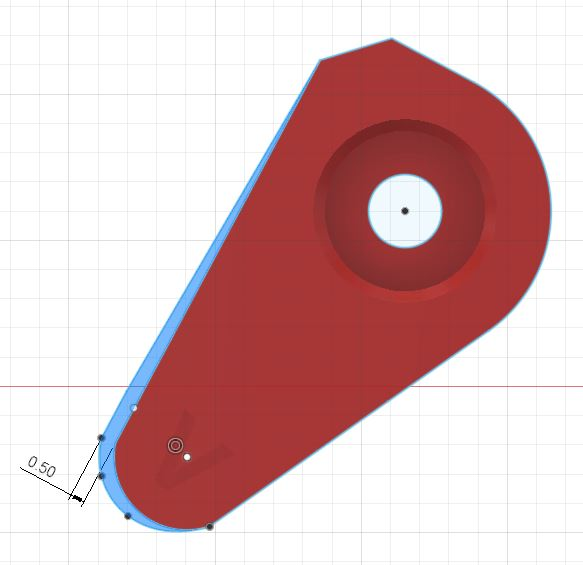

<h1 align="center"><ins>Triple-Decky Filament Block</ins></h1>

<H2 align="center">Filament block with  triple decks for ERCF V1/V1.1, Sturdy Bunny and ERCF V2.</H1>

## What is it ?

**Triple Decky** is based on the Sturdy Bunny filament block from **Sneakytreesnake** that incorporate the MR85ZZ bearing making the need for bearing blocks obsolete. It is a replacement for the filament block on ERCF V1 and Sturdy Bunny. Its goal is to avoid the filament to move in or out the filament block while loading or unloading another gate.
To do that, the filament block consist in 2 hinged parts (decks), that are kept apart by magnets. The filament is lifted by 1 mm from the bottom BMG gear.
The tophat comes on top of the 2nd deck and has the top BMG gear as before.
An integrated tophat based on number 1 tophat locker to be used with Springy [from Moggieuk](https://github.com/moggieuk/ERCF-Springy/tree/main) on Rev B and C.
Although Rev B version still has the possibility to install the magnetic gate, it is normally not needed anymore.
It will not be possible to install the magnetic gates on Rev C.
The width is 23.05mm as the latest Sturdy Bunny filament block that incorporate the bearing in the block.
To take all the benefit of the Trple Decky Filament Block, it is recommended to use a good buffer system (preferably a single loop buffer) The PTFE tube should not apply down force on the ECAS so the magnet can do their work correctly.
For people who needs a bypass block, there will be one incorporated in the "filament block end" of ERCF V2. A stand alone Bypass block that can be placed anywhere on the 2020 extrusion is also available on the triple decky Github. (Bypass_with_ECAS.STL) 
***
## Summary.
* **[Bom](#bom)**
* **[Printing Tips](#printing-tips)**
* **[Cleaning tips](#cleaning-tips)**
* **[Assembling tips](#assembling-tips)**
* **[Triple Decky for Sturdy Bunny and ERCF V2](#triple-decky-for-sturdy-bunny-build-on-a-2020-extrusion)**
  * **[Revision C for 3 positions servo "3PS"](#triple-decky-for-3-positions-servo-brake-release)**
    * **[Important note about Rev C 3 positions servo](#important-note-about-the-3ps-version)**
  * **[Revision C for magnet release brake ](#triple-decky-for-magnet-brake-release)**
  * **[Revision B ](#triple-decky-rev-b)**
* **[Triple Decky for ERCF 1.1](#triple-decky-for-ercf-v1)**
***
## Latest updates.

* #### Triple Decky Base C6.3. *Aug 31, 2023*
  
  No change in the main geometries. Only aesthetic change to blend better with filament path C6.3.

 

You can still find the Triple_Decky_Base_C6_0.stl in the archive folder.

* #### Stand alone Bypass Block with ECAS. *Aug 25, 2023* 
     
   
You can find it in stl/sturdy bunny

  
* #### New Filament Path Rev C6_3. Read more about it [here](#update-6_3). *Aug 25, 2023* 

* #### Triple Decky Rev C for 3 positions servo STLs. Make sure to read the [Important Note Below](#important-note-about-the-3ps-version) first !!!

* #### Triple Decky Rev. C. Read the details [here](#triple-decky-rev-c)

***
## **Yet in development :**
* **ERCF V2 :** at this moment, ERCF V2 is in development by a team of designers. Lots of things have been developed and are tested, but regarding the filament blocks, no decision have been taken on which version of Triple Decky or another type will be used.
  * Mods in progress :
    * Sturdy Bunny: https://github.com/sneakytreesnake/SturdyBunnyProject
    * Springy: https://github.com/moggieuk/ERCF-Springy/tree/main
    * Ejection Assisted Purge: https://github.com/bombela/EjectionAssistedPurge
    * Binky: https://github.com/mneuhaus/EnragedRabbitProject/tree/main/usermods/Binky
    
   

**I have re-structured this GitHub to show only the latest versions of each type. All previous STLs are available in the Archives folder.**
***
## BOM.
For each block you need :  
  * #### Rev B.
    * 1 M3x8 SHSC (to mount the base on the 2020 extrusion)
    * 1 M3x16 SHSC (to mount the latch on the base)
    * 2 6x3 magnets (between the base and the filament path)
    * 1 ECAS (on the filament path)
    * 1 set of BMG (on the D-shaft in the base and in the top hat)
  * #### Rev C magnet release trap.
    * 1 M3x8 SHSC (to mount the base on the 2020 extrusion)
    * 1 M3x16 SHSC (to mount the latch on the base)
    * 1 M3x3 set screw. Length: from 2 to 3mm (to install in the trap) (M3x2 can be found in BMG).
    * 3 6x3 magnets (between the base and the filament path and at the back of the filament path)
    * 1 ECAS (on the filament path)
    * 1 set of BMG (on the D-shaft in the base and in the top hat)
  * #### Rev C 3 positions servo release trap.
    * 1 M3x8 SHSC (to mount the base on the 2020 extrusion)
    * 1 M3x16 SHSC (to mount the latch on the base)
    * 1 M3x3 set screw. Length: from 2 to 3mm (to install in the trap) (M3x2 can be found in BMG).
    * 2 6x3 magnets (between the base and the filament path)
    * 1 ECAS (on the filament path)
    * 1 set of BMG (on the D-shaft in the base and in the top hat)

   
   [Summary](#summary)
*** 
## **Printing tips:**
  * Make sure your **printer is well tuned**, especially the first layer height. If it is too thick, the brake (trap) will be too thick and will not move freely inside the filament path.
  * All STL were tested OK with ABS and ABS+ 
  * Use voron standard print profile ( I use Andew Ellis ABS print profile).
  * The 3 main parts are fitting together using a kind of hinge. They should fit together without filing and with a little bit of play. 
  * For unknown reason, Super Slicer and Prusa slicer reports 6 open edges on the filament path STL. **DO NOT try to fix it**, otherwise you will have support that are filled up with infill and more than one perimeter thick. 
  * Make sure you have "Thin wall" enable, otherwise you won't have supports. Set also the speed for thin wall around 50% of the external perimeter speed.
  * It is also better to print a few spare traps. The sides are quiet thin, and it could be possible to break one if you remove the filament path too often.
 [Summary](#summary)
***
## **Cleaning tips:**
  * All support should come off very easily.
  * There should be very little part cleaning necessary
    * Using a 2mm drill bit, clean the filament path
    * using a needle file, clean the rectangular hole where the trap is going in on the filament path
    * The trap part should have a thickness of 3.05mm, use a file to make it <= 3.05mm or tune your first layer.
    *  Make sure that the rectangular hole in the filament path Rev C is clean so the trap/brake can fit loosely in. There should be 0.5mm clearance.
    * On the screw trap part you need to make sure that there are no plastic between the thread of the set screw and the filament. Use a sharp x-acto knive to open the space between the 2 holes.
   
    

    
    * On Rev C with magnet brake release, make sure the hole for the back magnet is clean, the magnet should go down against the bottom of the hole.  
    * On the tophat up to version C6.2 it could be possible that depending on the type of ABS(+) you're using, the tophat does not move as freely as needed. To solve that, you can cut or file down one layer off from the tang on the support side. This is fixed in the next version C6.3. I only encounter that problem with my ESUN Green ABS+.

    

      
       [Summary](#summary)
***
## **Assembling tips:**
  * Rev B is self explanatory. The 3 parts goes together by sliding the tangs into the correponding cavities that makes the hinges.
  * Rev C need a bit more attention to assemble the filament path on the base.
    * 1. Insert the M3x8 SHCS screw into the side hole of the base before installing the filament path. You will be able to access the screw through the filament pass later. (If you want to use 4 magnets, than you need to install the base on the 2020 extrusion before installing the magnets and filament path. 4 magnets are normally not necessary.)

      

    * 2. Insert the magnet into the middle holes of the base and the filament path. The magnet must repell each other.
      * Optionally, you can use another set of magnet into the side holes if needed. In that case, the screw will be unaccessible without disassembling the parts
    * 3. Insert the trap into the female dovetail.
      * If you use the screw trap, insert the set screw at a slight angle. The 2 holes are angled by about 2°. Insert the set screw in the top hole.  
      The set screw can be :
        * M3x3mm
        * M3x2.5mm
        * M3x2mm, the same that you can find in the BMG.   
       
      

    * 4. Align the filament path above the base so they are parrallel and the top of the brake (trap) is "almost" inside his corresponding hole in the filament path and the tang of the hinge is just above the cavity of the base. 
     
      

    
    * 5. Press firmly the filament path into the base. It snap into place easily.
    
      

  * Magnets orientation.
  
       

  * Assembling video.
   
  

[Summary](#summary)

***
## Triple Decky for Sturdy Bunny build on a 2020 extrusion 
 ### Triple Decky Rev C
   **It is an evolution of Rev B. with the following new features.**
   *  It has a kind of brake to press against the filament when the gate is not selected. The exit side of the filament path can lift up about 0.5 mm, enough to make the filament touching the brake part (trap). To release the brake it will use either :
        *  with a magnet that will be pushed back by the encoder magnet.
        *  by using a special tophat that will need a 3rd position of the servo to be able to move the selector. (software in development)

   * The brake part will be easily replaceable in case it breaks.
   *  The multi-color tag plates will be the same for input and output side. (Same as in version B4 Base)

   *  The use of the old magnetic gates will be **impossible** on that version.
   *  If you are using Happy Hare software, you should decrease the "parking_distance" in the ercf_parameters to about 15 so the filament parks inside the trap.
   *  It is normal that the filament does not pass the trap when inserted manually. When the gate will be selected, Happy Hare will load it without problem. If you want to lock it inside the trap, than you need to push down the exit side of the filament path with your finger and insert the filament about 5 mm further.

[Summary](#summary)
***  
### **Triple Decky Rev C6 magnet brake release or 3 positions servo.** 

#### Update 6_3 
 This update concern all **Filament Path revision B and C for Sturdy Bunny**. The ECAS is moved 4mm out to enable the insertion of the PTFE tube inside the part. I recommend to use it over the previous versions.
 * This allow for easy threading of the filament and keeps also the geometry for Endless Spool function.
 * It avoids the ECAS to go slowly out of its cavity after some time.

      

      
#### Update C6 
This is an update from Rev C5 that fixes the following issues:
  * wall around the bearing cracks
  * filament path output side rubbing on the encoder and get pushed down. 
  * **It has the following new feature :**
    * thicker wall around the bearing
    * output face of the filament path is tilted 4° to avoid rubbing on the encoder cart
    * new tophat to match the brake release magnet new position

        
 

  * **Warning:**
          * C6_x base need to have C6_x filament path
          * C6_x filament path need to have C6_x tophat
          * C5_x base is compatible with C6_x filament path
          * C5_x filament path is compatible with C6_x tophat
          * For all Rev C, only the integrated tophat are available, and needs the Springy servo holder to work. (see above in mods in progress) 

      

           
***
### **Triple Decky for 3 positions servo brake release**

   * This version uses the servo to push the filament path down so the filament is free to move when the gate is selected.
   * When the gate is not selected, the filament will be hold still by the trap.
   *  New integrated tophat based on number 1 tophat locker to be used with Springy [from Moggieuk](https://github.com/moggieuk/ERCF-Springy/tree/main) 
    
      
 

      
 

  
  [Summary](#summary)

#  **IMPORTANT NOTE ABOUT THE 3PS VERSION.**
   *  **If you want to use the C6 with 3 positions servo YOU HAVE TO USE the latest Happy-Hare software (HHv2) that support the servo 3rd position. It is public now. Otherwise IT WILL NOT WORK.     You need also to update KlipperScreen for Happy Hare.**
   * The base is the same for both Rev C versions (Triple_Decky_Base_C6_3.stl).
   * The taps are the same for both Rev C versions (Traps folder).
   * If you are already using the magnet version, you can still use it if you print the universal tophat ([a]Triple_Decky_Tophat-integrated_Universal_Mag&3PS_C6_3.stl). **DO NOT USE THIS STL IF YOU DO NOT HAVE ENABLED THE 3rd POSITIONS FOR SERVO IN YOUR SOFTWARE!!!**   **You must have the servo_move_angle defined in the mmu_parameters.cfg**
   * If this is your first use of Rev C 3PS, then it is better to use the dedicated tophat for 3PS ([a]Triple_Decky_Tophat-integrated_3PS_C6_3.stl).
   * For better results, you should use the special servo arm with rounded edges for this repo (Servo Arm MG90S_for_3PS.stl or Servo_Arm_Savox_for_3PS.stl) .
   * **Software parameters** 
     * Add "servo_move_angle: (move position angle)" in mmu_parameters.cfg
       * **For MG90S**
           * servo_move_angle: 45
           * servo_up_angle: 24
           * servo_down_angle: 115
          

       * **For Savox SH0255MG**
           * servo_move_angle: 95
           * servo_up_angle: 115
           * servo_down_angle: 45
         
      * Change the "encoder_parking_distance:" in mmu_parameters.cfg so the filament parks in the trap. (for me I change it to 15, it was 23) 
  
   * **Servo positions** 
      Make sure to adjust the 3 position of your servo arm so the arn does not hit the tophats when the selector is moving. See picture below to fiind out where the position should be for the 3 positions.
  
       * Servo Up. (trap released / print without sync)
  
       

       * Servo Move. (trap locked / selector movement)

       

       *  Servo Down. (trap released for Load/unload or print with sync mode)
  
       

      

 
  * **Servo arm geometry for 3 positions servo**  
      The servo arm is based on the Springy servo arm. To have a better effect when using the 3 positions servo, the geometry is modified as shown on the picture below. The blue area shows the added part. This make the "UP" position pushing a bit more to release the trap. The length is also increased by about 0.3mm in the "DOWN" position. It is, therefore, better to use it with Springy from [@moggieuk](https://github.com/moggieuk/ERCF-Springy/tree/main).
      This version is available for MG90S and Sävox SH-0255-MG in the "Rev_C/Filament_Path_for_3_position_Servo" sub-directory of this repo. 

. 

  * **Servo splines differences** 
      The servo arm splines are different between the MG90S (blue shade on the picture) and the Sävox SH-0255-MG (in red on the picture). Be sure to use the arm the matches your servo.

[Summary](#summary)
***
### **Triple Decky for magnet brake release**

   * This version uses the encoder magnet to push the filament path down so the filament is free to move when the gate is selected.
   * When the gate is not selected, the filament will be hold still by the trap.
  *  New integrated tophat based on number 1 tophat locker to be used with Springy [from Moggieuk](https://github.com/moggieuk/ERCF-Springy/tree/main)
            

       
 

       
 

[Summary](#summary)
***
### **Triple Decky Rev B**

   * The output side of the filament path has been tilted by 4° to avoid rubbing on the encoder when the selector is moving.
   * The input side tag plate is rotated 90° for better printing without support.
   * New multicolor tag plates for 12 carts on the input side.
   * New multicolor gate plates for 12 carts on the output side to replace the magnetic gate. 
   * New integrated tophat based on number 1 tophat locker to be used with Springy [from Moggieuk](https://github.com/moggieuk/ERCF-Springy/tree/main)  
   * optional base to use the old magnetic gates. In that case, the small part of the hinge of the filament path must be cut at the mark.
   * The latch has an optional set screw to apply a little bit of friction on the filament. This help the filament to stay still in case of vibrations.

   * Since this version has no real brake system. It is better to use a single loop buffer system that provide more stability of the filament when it is in the buffer.
  
      
  

       
       [Summary](#summary)    
*** 
## **Triple Decky for ERCF V1**

   * This is for the original design that is build with M5 all threaded rod. This version will not be developed further because almost all users / builders are moving to Sturdy Bunny, or the coming (soon) ERCF V2.

   
      

[Summary](#summary)

