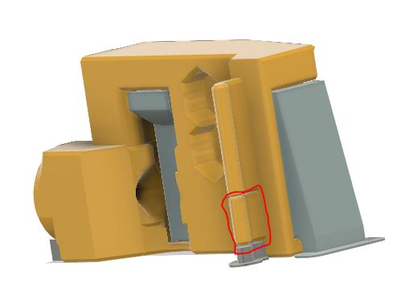

# **Some notes on how to use the version B4**
## **Warning**
 **Be really careful when inserting the Gate plates or the magnetic gates in the filament path. The way it is printed can cause cracks when inserting. Be sure the cavity is clean before inserting the gate plates.**

## **What to print ?**

 * **You want to use the new design without magnetic gates.**
   * print the **Trpile_Decky_Base_RevB4_1.stl** 
   * print **Triple_Decky_Filament_path_RevB4_1.stl**.   
   * print the multicolor **Triple_Decky_Tag_Plates_X.stl** from the **Base_Tag_Plates** folder for the Triple_Decky_Base.
   * print the **Tag_Gate_X.stl** from the folder **Filament_path_Tag_Gates** for the Filament path output side.
    * print one of the tophat :
      * **[a]Triple_Decky_RevB4_1_Tophat_integerated.stl** if you are using Springy. It may also work with original selector. It is based on number 1 Tophat locker
      * **[a]Triple_Decky_RevB4_1_Tophat.stl** if you want to use your original tophat lockers.
    * print the latch **[a]Triple_Decky_Latch_Beta3_1.stl**

* **You want to use the old magnetic gates.**
  * print the **Trpile_Decky_Base_RevB4_1_Magnet.stl** from the folder **Optional for old magnetic gates**.
  * print **Triple_Decky_Filament_path_RevB4_1.stl** and cut the small part of the hinge. 

  * use your original magnetic gates.
  * print the multicolor **Triple_Decky_Tag_Plates_X.stl** from the **Base_Tag_Plates** folder for the Triple_Decky_Base
  * print one of the tophat :
    * **[a]Triple_Decky_RevB4_1_Tophat_integerated.stl** if you are using Springy. It may also work with original selector. It is based on number 1 Tophat locker
    * **[a]Triple_Decky_RevB4_1_Tophat.stl** if you want to use your original tophat lockers.
  * print the latch **[a]Triple_Decky_Latch_Beta3_1.stl** 

