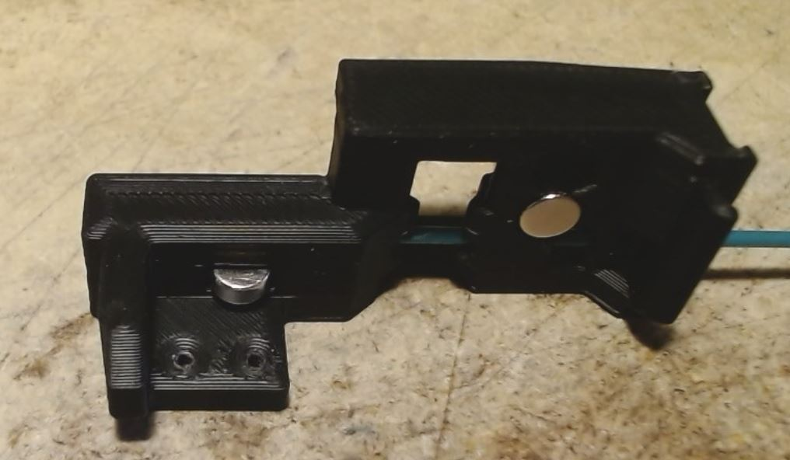
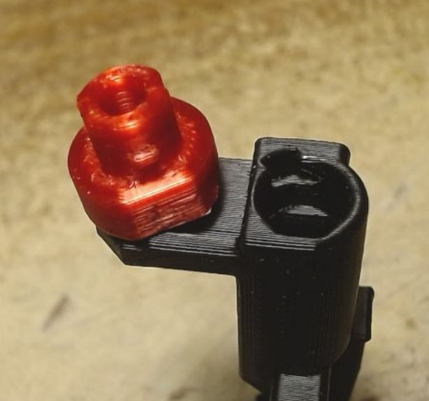

# C9S : Pre-gate sensor 
## Specifications.
* Since all previous pre-gate sensors uses a 5.5mm ball place in the same vertical plane that the BMG, sometime a notch is ground in the filament from a previous bad load. In this case when the ball drop in that notch, the gate is declared empty by Happy Hare and the print is paused.
* To solve that problem, that best solution would be to orient the ball and the switch in a 90° plane, so the ball can't fall ini the notch. This is working very well on specially designed pre-gate sensors, but can't be implemented in the filament path because there are not room enough.
* To solve the problem on the filament path, a special "notch mask" was developed, so the ball never comes in contact with the filament, thus can't fall in the notch and give false triggering.
  * A flat piece is placed between the filament and the ball to make the notch invisible to the ball. To make that device more stable, the ball is replaced with a 6x3 magnet.
 

  * For easy installation, an insert is slid together with the interface plate in the filament path. An opening is made on the side of the filament path, so the insert can be removed easily with a 2mm allen key.
 

  * Since the pre-gate sensor applies a bit of tension on the filament, it is recommended to print the insert and the interface plate in a slippery filament like PETG.

 ## How to install and remove it.
 * **What you need :** 
 

   * 1 filament path C9Sx
   * 1 insert (green on the picture)
   * 1 interface plate (red on the picture)
   * 1 6x3 magnet
   * 1 Omron switch
   * 2 M2x10 screws
 * **Installation :** 
   * Insert a small piece of filament in the insert.
 

   * Place the insert with the opening up, and drop the interface plate in the opening with the small wings up.
 

   * Insert the whole assembly in the filament path. The 2mm hole first.
 

   * Push the insert fully in with a 8mm rod (x-acto knive, or 8mm drill). Make sure you see the interface plate through the magnet hole.
 

   * Place the magnet in the hole.
 

   * Keeping the magnet in place with your finger, turn the filament path on its side.
 

   * Install the switch, and remove the filament. The pre-gate sensor is ready. You can install the filament path on its base.
 

 * **Removing the insert.**
   Since all parts are made from plastic, it is possible that the insert and the interface plate must be replaced at a certain point of time. 
   * Remove the ECAS or magnet entry
   * Remove the switch and the magnet.
   * Turn the filament path on its side so you can see the long 2mm opening.
 

   * Insert a 2mm allen key on the left side of the opening deeply enough that it goes into the 2mm hole of the insert.
 

   * Tilt teh allen key to the left, so the insert is pushed out of the filament path. Then put the allen key behind the insert and push it completely out.
  

## ECAS version.
This is the same as the normal C9.x filament path. The ECAS is simply pushed in. This version will need to extract the ECAS if the insert must be replaced. It is not the preferred version because it is possible that the ECAS does not stay in place after it was removed a few time, and gluing it in place is not a good idea.
 

## Entry Magnet version.
This is the preferred version, because the entry part is hold in place by a kind of bayonet. It can be removed as often as needed.
The filament path is specially made for that.
 

* The entry part and ECAS parts need a 10x3mm magnet with a 4mm hole in the center.
 

* The entry part is inserted in the filament path, and turn 30° CW to lock it in place.
 

* The counterpart receive the same magnet and an ECAS.
 

* The magnet assembly is ready.
 

