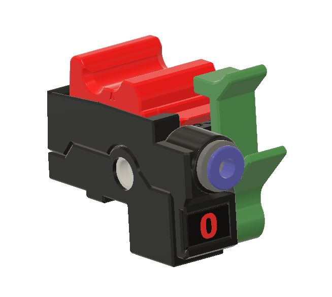
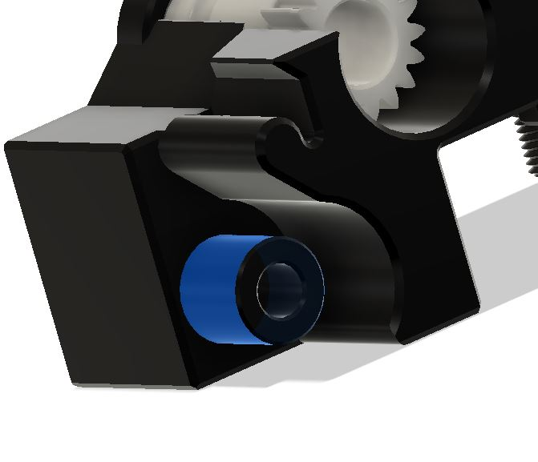
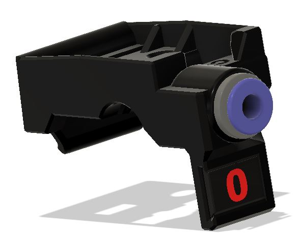
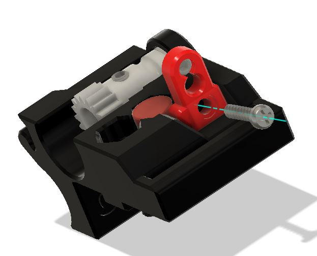
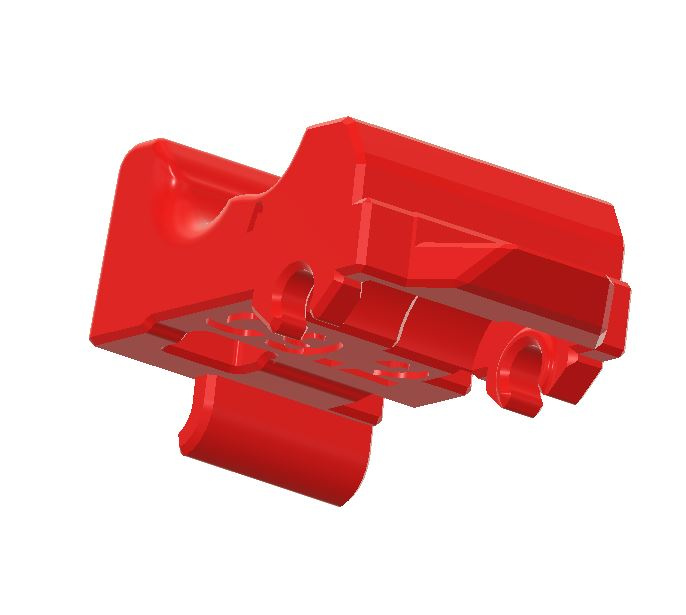
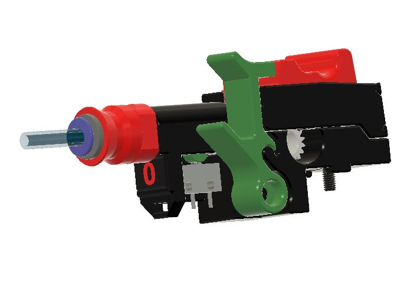

 

  * Revision C9.x brings an almost built-in supports free. There is still one built-in support on the tophat.
    * The latch is modified for better integration with Cotton Tail and the new modified base. 
    * The base is shorter and the small latch centering part should not break anymore if the screw is screwed in correctly.
 

    * The entry tag plate is move from the base to the filament path. This makes it easier to install the tag plates after the ERCF unit is build and functioning. The tag plates can then be printed in multi-color with the freshly build unit.
 
 Both tags are the same as C7.
    * The trap design is modified to accommodate the support free base. It is now connected to the base with an M2x10 screw.
 

    * The tophat has a lower profile than the previous version. This should fix the servo down problem that some users have encountered.
    * There is an optional tophat with snap-in BMG.
 

    * There are 2 optional versions of C9 called C9S which incorporate a pre-gate sensor Those versions are made for people with limited space and that does not want to use the Cotton Tail full or pre-gate version.
      * These versions of pre-gate sensor is optimized to avoid false triggering if the filament have a notch ground from previous bad load.
      * The 5.5mm ball is replaced by a 6x3mm magnet for more stability of the anti-false triggering device.
      * Although this version works very well for automatic insertion of the filament supported by Happy Hare, it may or may not work well for endless spool. 
      * One version uses an ECAS to hold the PTFE tube.
 

      * The other uses magnets to hold the PTFE in the filament path.
 

  
 
  * The C9S Pre-gates Sensor STL are in the **Optional Pre-gate Sensor** folder of Rev_C9. See readme file of the folder for more details.
  
  **IMPORTANT NOTE : The C9.x parts are not compatible with the previous C7.x version.**

